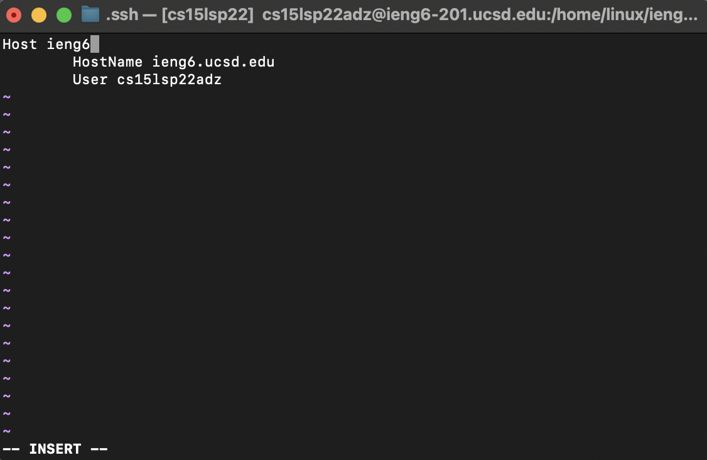
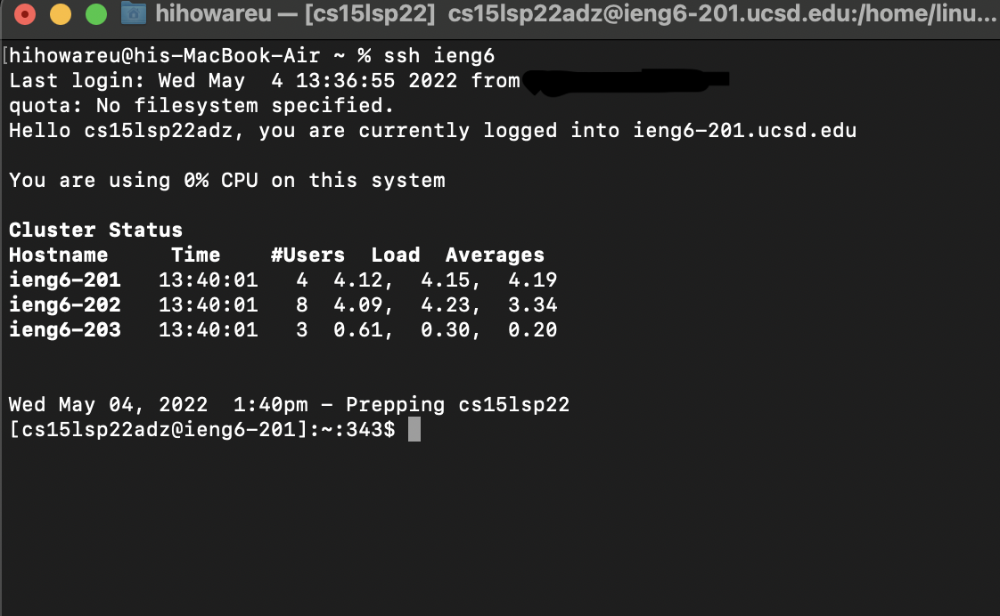
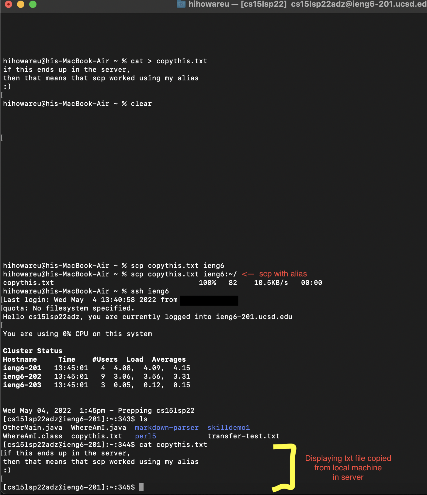
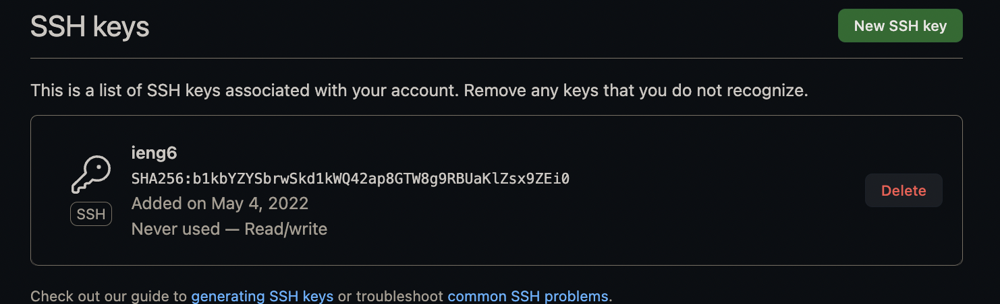
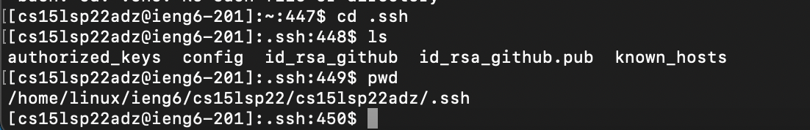
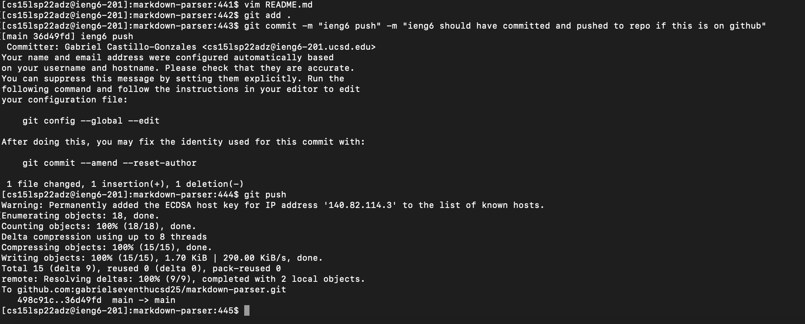
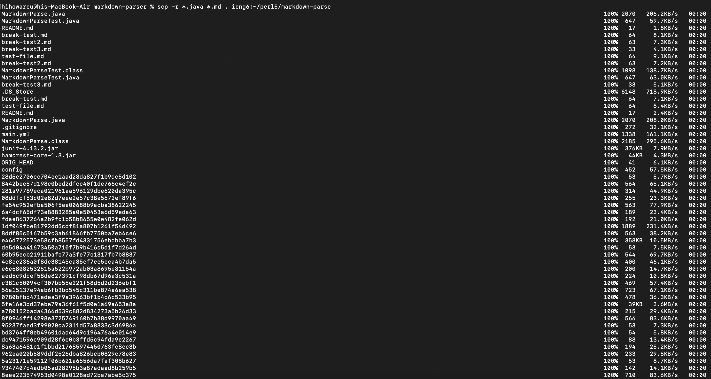
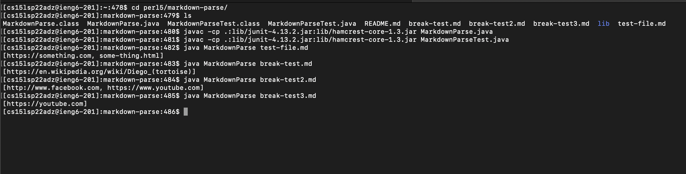
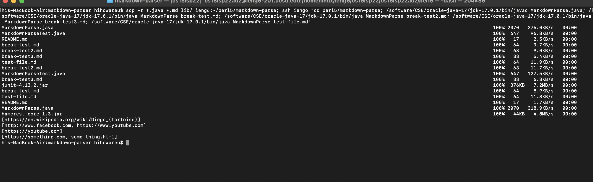

# Lab Report 3 - Week 6

1. [Steamlining SSH Configuration](#streamlining-ssh-configuration)
2. [Setup Github Access from ieng6](#setup-github-access-from-ieng6)
3. [Copy Whole Directories with scp](#copy-whole-directories-with-scp)


## Streamlining SSH Configuration
By adding the lines in the screenshot below to my ~/.ssh/config file, I am able to simply connect to my server through a shorter alias. I edited my config file using vim on my terminal.



Below is me using my alias to connect via SSH:



Below is me using scp with my alias to copy a file from my local machine to my server:



Now instead of typing out my entire username, I can use the short alias to connect via SSH or copy via SCP. By the way, any alias can be used.


## Setup Github Access from ieng6
Using SSH, I am able to push any commits made from my ieng6 server to the repo on GitHub.

First, I made an SSH key using ssh-keygen on my ieng6 server, then I copied the public key contents and made the public key on my GitHub account.



The private key (named id_rsa_github) is located in my .ssh folder on my ieng6 server, as shown below:



Below is me committing my changes to the repo and pushing them to the remote repo on GitHub:



[Click here to see my commit!](https://github.com/gabrielseventhucsd25/markdown-parser/commit/36d49fdb8dddc3867247966bf4deac513e11ceaa)


## Copy Whole Directories with scp
Using scp, you can copy entire directories (including all files and subdirectories) to your server. 

I copied my entire markdown-parse folder using this command after I used cd to go to that directory:
```
scp -r *.java *.md /lib username-here:path-here
```
Instead of using my username, I used my alias from earlier, and the "path-here" is the path I copied to directories contents to on my ieng6 account. I also used *.java and *.md to specify that those files copy to the server since I thought all other file types were not needed. Here is me running the command below:



Below is me displaying the files copied on my server, compiling the files, and then running the tests:


You can also just use one command to do all of this:
```
scp -r *.java *.md lib/ <username/alias-here>:<path-here>; ssh <username/alias-here> "cd <path-here>; /software/CSE/oracle-java-17/jdk-17.0.1/bin/javac <java-file-here>; /software/CSE/oracle-java-17/jdk-17.0.1/bin/java <java-class-file-here> <args-here>
```
Here is me using it as shown below:
