# **Lab Report 4 - Week 8**

1. [Testing Snippets on My Repo](#testing-snippets-on-my-repo)
    - [Snippet 1](#snippet-1---my-repo)
    - [Snippet 2](#snippet-2---my-repo)
    - [Snippet 3](#snippet-3---my-repo)
2. [Testing Snippets on Other Group's Repo](#testing-snippets-on-other-groups-repo)
    - [Snippet 1](#snippet-1---other-repo)
    - [Snippet 2](#snippet-2---other-repo)
    - [Snippet 3](#snippet-3---other-repo)
3. [Changes to My Repo That May Work for the Snippets](#changes-to-my-repo-that-may-work-for-the-snippets)

# [Testing Snippets on My Repo](#lab-report-4---week-8)
**[Link to my markdown-parse repository](https://github.com/gabrielseventhucsd25/markdown-parser)**

**I determined that the output should be an array of ALL of the links in each snippets. That is the expected result in all of the JUnit tests for each snippet.**
## [Snippet 1 - My Repo](#lab-report-4---week-8)
Below is Snippet 1 test on my tester file:
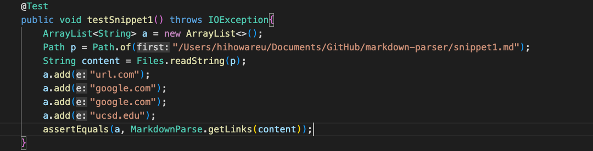

The test ended up failing:
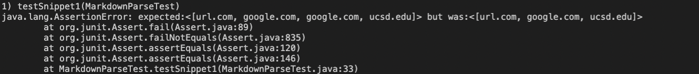
## [Snippet 2 - My Repo](#lab-report-4---week-8)
Below is Snippet 2 test on my tester file:
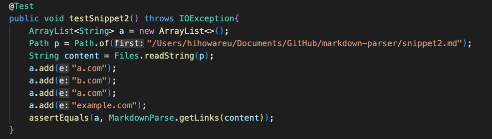

The test ended up failing:
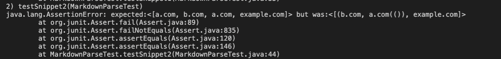
## [Snippet 3 - My Repo](#lab-report-4---week-8)
Below is Snippet 3 test on my tester file:
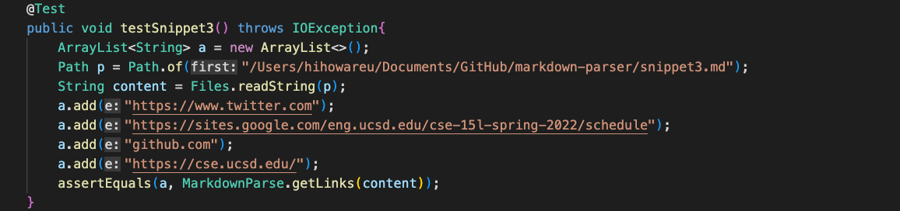

The test ended up failing:
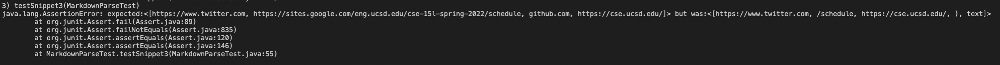
# [Testing Snippets on Other Group's Repo](#lab-report-4---week-8)
**[Link to other group's markdown-parse repository](https://github.com/Barakar13/markdown-parser)**

## [Snippet 1 - Other Repo](#lab-report-4---week-8)
Below is Snippet 1 test on other group's tester file:
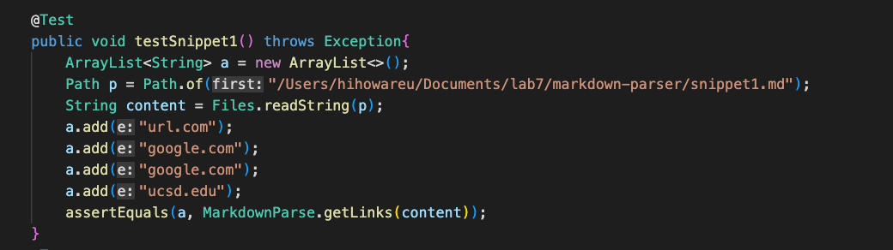

The test ended up failing:
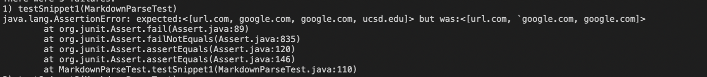
## [Snippet 2 - Other Repo](#lab-report-4---week-8)
Below is Snippet 2 test on other group's tester file:
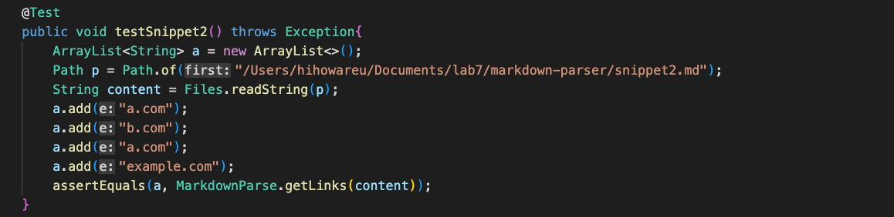

The test ended up failing:
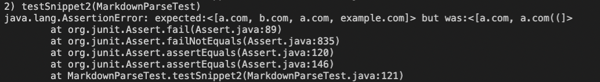
## [Snippet 3 - Other Repo](#lab-report-4---week-8)
Below is Snippet 3 test on other group's tester file:
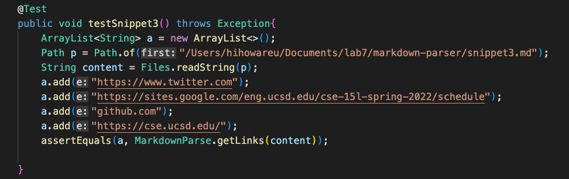

The test ended up failing:
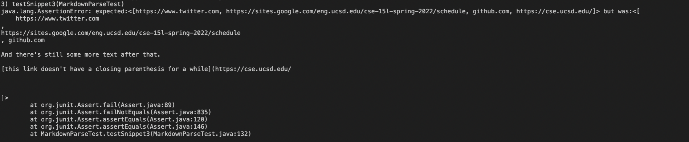
# [Changes to My Repo That May Work for the Snippets](#lab-report-4---week-8)
For Snippet 1 and related cases, I believe that accmodating for special characters outside of the link on the same line would help, since I saw that the test did pass once I got rid of the last backtick on the second link. I don't think that this code change would take less than 10 lines because I would have to identify the last part of the link (i.e. ".com", ".png", ".html", etc.). Doing this would stop the code from checking beyond the link and move on to the rest of the .md file.

For Snippet 2 and related cases, I think the best solution should be the exact solution I mentioned for the previous snippet. The reason why I failed the test for this snippet was that it included the extra characters after the links, so if I were to identify the end of the link, then I wouldn't have to worry about any characters after the link. As mentioned before, this code would not be small because I think it is very complicated to find the end of a link, especially if it has multiple periods.

For Snippet 3 and related cases, I think I would have to change the entirety of my for loop in the while loop in my MarkdownParse.java file since some links can be detected but the ones that do not are because the for loop incorrectly assigns either partial characters in the link or characters not in the link to the string that is to be added to the array. This code change would not be less than 10 lines because I would have to identify if a line even contains a link, and if it does then I have to identify if the link goes to another line.