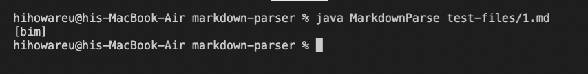
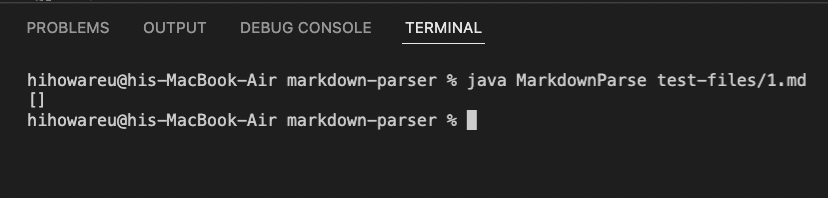
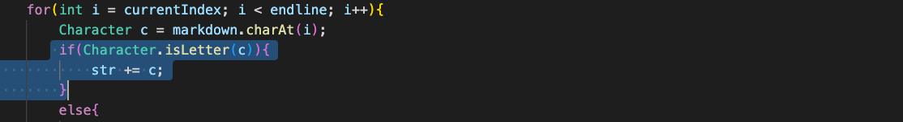
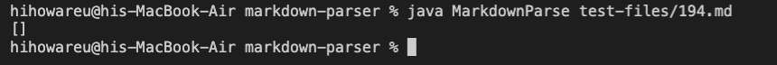
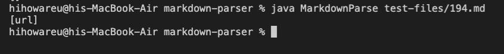
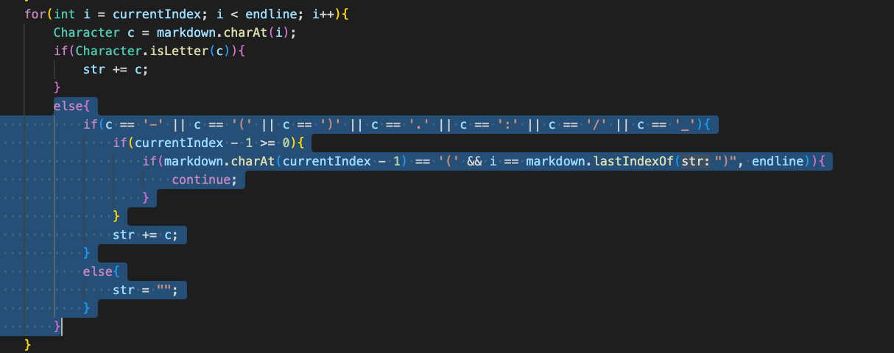

# **Lab Report 5 - Week 10**
1. [Introduction](#introduction)
2. [First Test](#first-test-1md)
3. [Second Test](#second-test-194md)

## Introduction
The two test files to compare both implementation of markdown-parser I found manually/randomly. I just clicked around the test-files/ directory and was able to luckily find two tests that produce different results.

## First Test: 1.md
Link to the 1.md test file [here](https://github.com/nidhidhamnani/markdown-parser/blob/main/test-files/1.md).

Using the CommonMark demo site to determine what the correct output should be, in this case the provided implementation's output was correct and my implementation's output was incorrect.

When testing 1.md, the correct output should be an ***empty list*** because there are no links in 1.md.

Here is the output from **my** implementation:

As you can see, the output is not an empty list, so it is incorrect.

Here is the output from the **provided** implementation:

The output is correct for the provided markdown-parser.

The reason why my implementation does not return an empty list is because my code automatically assumes that when checking a character in a line, if it is a letter then it must be valid. The screenshot below shows what the code looks like for checking characters that are letters:

How my code works is that it creates a string to add to the list to return in getLinks, and here it assumes that any character that is a letter should be in that string to add in the list, but that is obviously a bad assumption.

## Second Test: 194.md
Link to the 194.md test file [here](https://github.com/nidhidhamnani/markdown-parser/blob/main/test-files/194.md).

According to the CommonMark demo site, the output should just have been "my_(url)" (without the quotes) inside of the getLinks list that is returned. Both my implementation and the provided implementation however **do not** provide this output.

Here is the output from my implementation:

The list is empty, so the output is wrong.

Here is the output from the provided implementation:

Though closer to the right output, it is still wrong.

For my implementation, I believe the bug is that I do not account for spaces when checking for links in a line. If there is a space after the URL is already iterated through and added to the string to add to the list, then that space will just set that string back to an empty string. I believe that I would have gotten the correct output if that were not the case, and a good idea for a fix would be that if there is a space, then just continue down the line until a non-space character is found and then go through the normal process.

The code of this bug is shown below:
