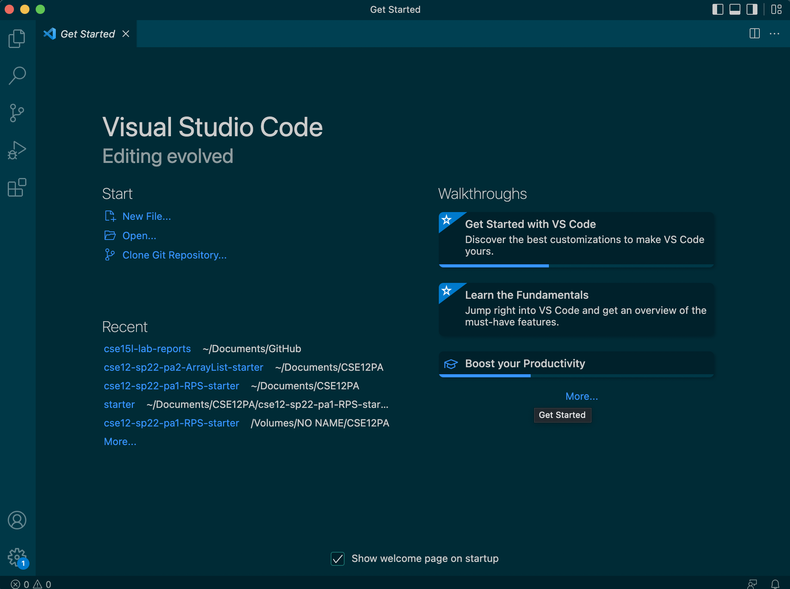
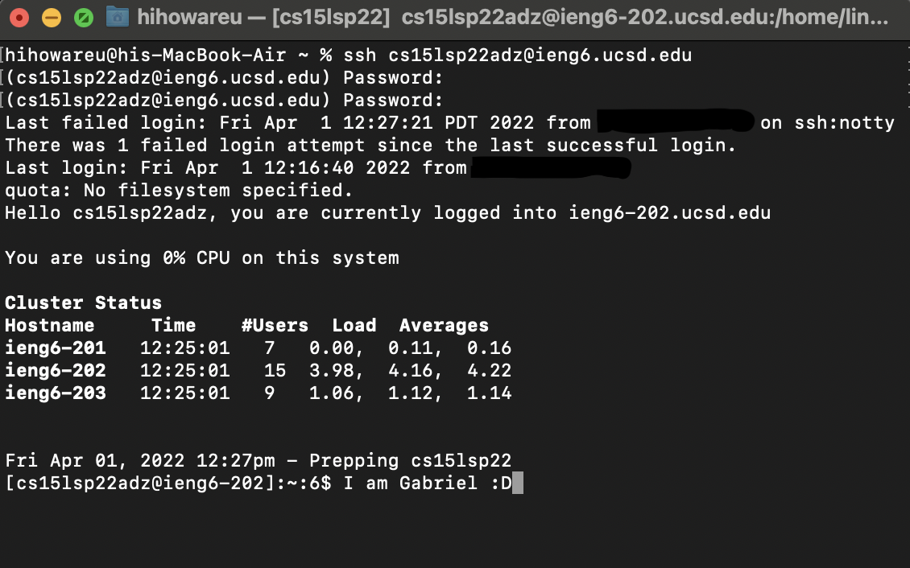
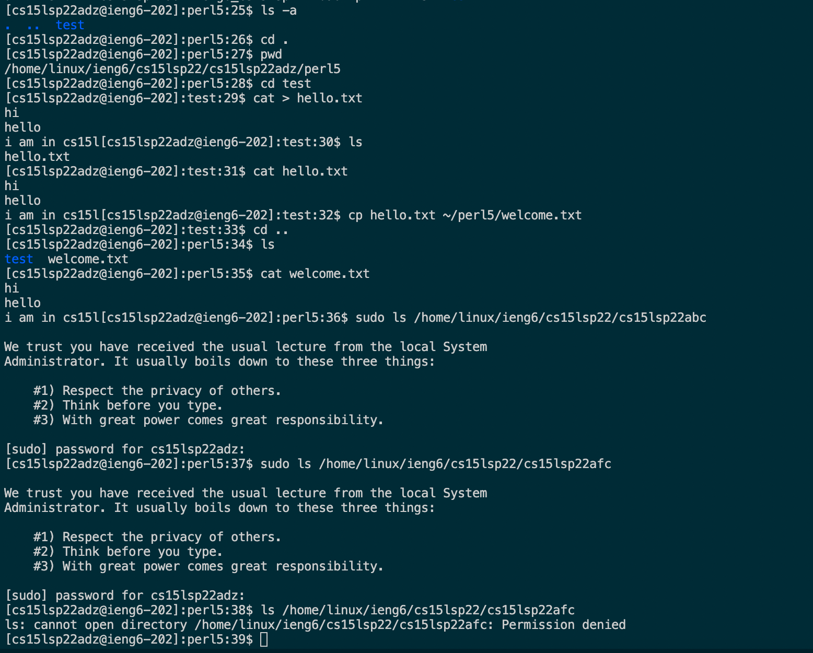
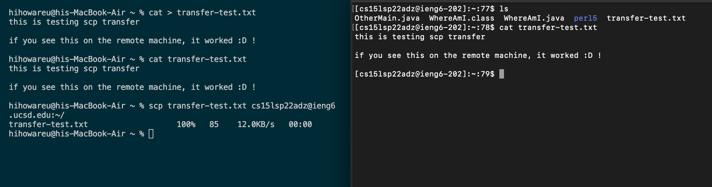
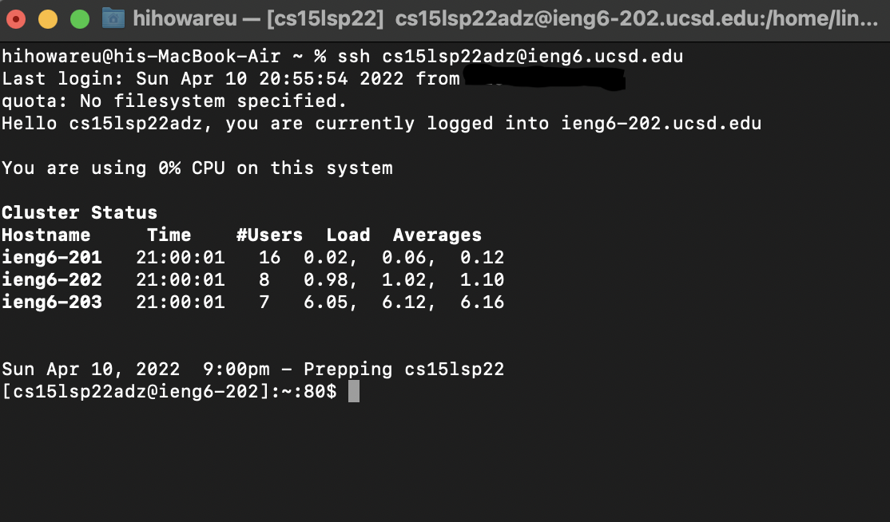
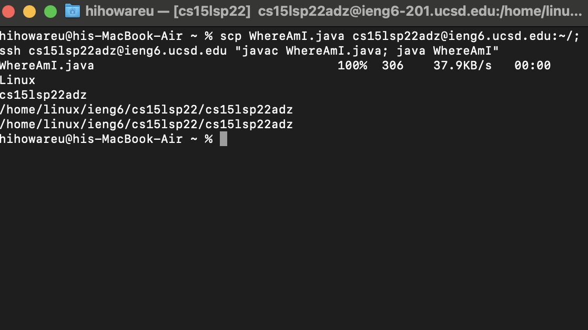

# Week 2 Lab Report
1. [Introduction](#introduction)
2. [Installing VSCode](#installing-vscode)
3. [Remotely connecting to your account](#remotely-connecting-to-your-account)
4. [Testing out UNIX commands](#testing-out-unix-commands)
5. [Using scp to move files from client to server](#using-scp-to-move-files-from-client-to-server)
6. [Setting up SSH Key](#setting-up-ssh-key)
7. [Optimization for Moving Files](#optimization-for-moving-files)


## **Introduction**
This is a tutorial for incoming 15L students. For reference, all of these steps were done under a *Mac*, which has an OS based on UNIX. For Windows users, this **may not** be the most helpful guide as there are different things you have to install as well as different commands to run.

## **Installing VSCode**
In this class, we will use Visual Studio Code (or just VSCode). [Clicking on this sentence will take you to where you can download it.](https://code.visualstudio.com/#alt-downloads) Since I have a Mac with an M1 chip, I chose the Apple Silicon installer. Below is my VSCode opened on a new window, which should look similar to yours after installation.



## **Remotely Connecting to Your Server**
After doing the appropriate steps to get your course specific account, you can now use the SSH protocol to connect to the server associated with it. SSH came pre-installed on my machine, so all I had to do was type in the terminal (which can be accessed through VSCode) via this command: 
```
 ssh **my-account-name-here**
 ```

After typing in my password when prompted, I was able to connect.




## **Testing Out UNIX Commands**
This class will use some basic UNIX commands. You'll be given a list on Canvas, but here is me trying some out. 



The last "ls" command gave me a "Permission denied" as I was trying to list the contents of one of my labmates, likely because I am not a higher level user than them.

## **Using scp to Move Files from Client to Server**
Using scp, you can securely transfer files from the computer you are using to the server you connected to via SSH. 



From my terminal on the left (which is on VSCode), I made a text file and then copied it to my server via scp. The text file successfully transferred as indicated from the terminal on the right, which is connected to my server.

## **Setting up SSH Key**
You can set up an SSH Key using the "ssh-keygen" command in order to not have to type in your password everytime you use ssh or scp. I used ssh-keygen, simply pressed return to have no passphrase, and then transferred the public key made in my .ssh directory to the ~/.ssh/authorized_keys directory that I made on my server.



As you can see, no password needed!

## **Optimization for Moving Files**

I have come up with a fast way to move a file using scp that will not take much effort from you, and this will be done with a .java file. All you have to do in this situation is run one line!
This line is:
``` 
scp <javafilename> <servername>:~/; ssh <servernamehere> "javac <javafilename>; java <classname>"
```
This one line will copy the java file to the server, compile the file in the server, and run it in the server!


