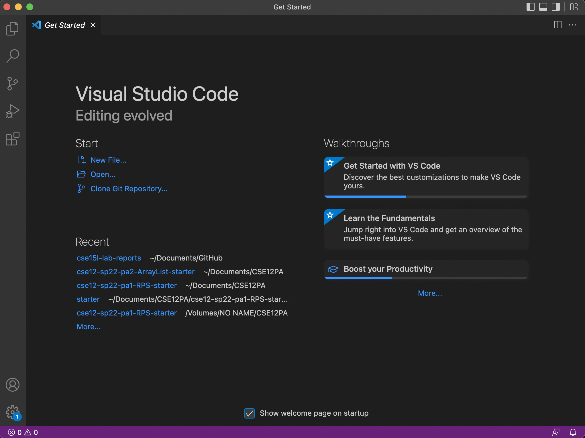

# Week 2 Lab Report
1. [Introduction](#introduction)
2. [Installing VSCode](#installing-vscode)
3. [Remotely connecting to your account](#remotely-connecting-to-your-account)
4. [Testing out UNIX commands](#testing-out-unix-commands)
5. [Using scp to move files from client to server](#using-scp-to-move-files-from-client-to-server)
6. [Setting up SSH Key](#setting-up-ssh-key)
7. [Optimization for Moving Files](#optimization-for-moving-files)

## Introduction
This is a tutorial for incoming 15L students. For reference, all of these steps were done under a *Mac*, which has an OS based on UNIX. For Windows users, this **may not** be the most helpful guide as there are different things you have to install as well as different commands to run.

## Installing VSCode
In this class, we will use Visual Studio Code (or just VSCode). [Clicking on this sentence will take you to where you can download it.](https://code.visualstudio.com/#alt-downloads) Since I have a Mac with an M1 chip, I chose the Apple Silicon installer. Below is my VSCode opened on a new window, which should look similar to yours after installation.

## Remotely Connecting to Your Account
After doing the appropriate steps to get your course specific account, you can now use the SSH protocol to connect to it. SSH came pre-installed on my machine, so all I had to do was type in the terminal (which can be accessed through VSCode) via this command: 
> ssh **my-account-name-here**

After typing in my password when prompted, I was able to connect.

## Testing Out UNIX Commands
This class will use some basic UNIX commands. You'll be given a list on Canvas, but here is me trying some out.

## Using scp to Move Files from Client to Server
Using scp, you can securely transfer files from the computer you are using to the remote computer you connected through SSH. 

## Setting up SSH Key
You can set up an SSH Key in order to not have to type in your password everytime you use the ssh or scp commands.

## Optimization for Moving Files
I have come up with a fast way to move a file using scp that will not take much effort from you. 