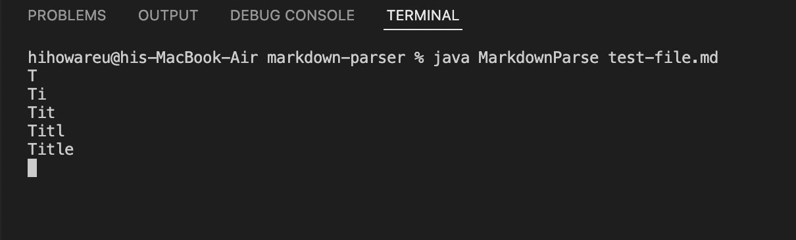
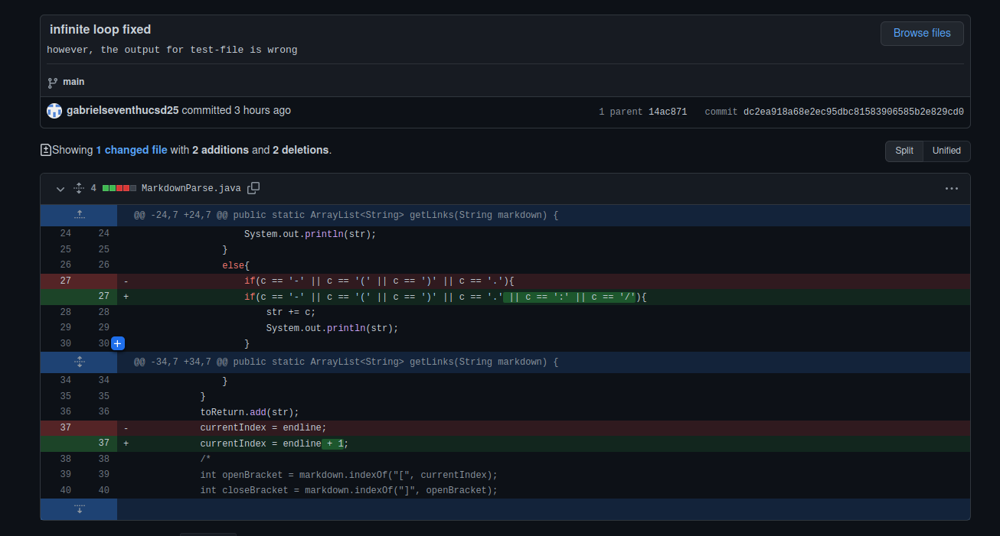
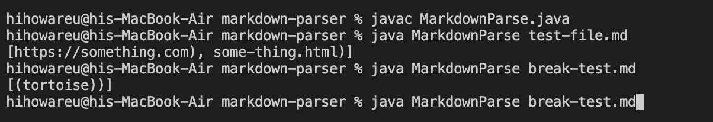
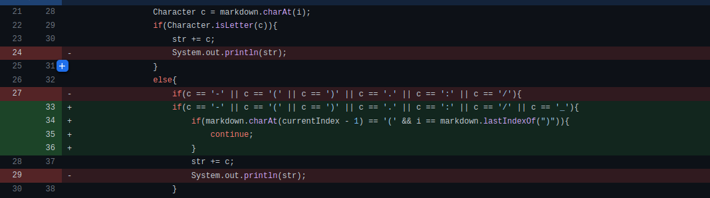

# Week 4 Lab Report

1. [Bug 1](#bug-1-and-code-change)
2. [Bug 2](#bug-2-and-code-change)
3. [Bug 3](#bug-3-and-code-change)

## Bug 1 and Code Change
I was made aware of a bug when my code was being stuck in an infinite loop. The screenshot below shows me testing my code via print statements to showcase the loop.

This would happen to all the files I tested but this is the .md file I tested: [test-file.md](https://github.com/gabrielseventhucsd25/markdown-parser/blob/main/test-file.md) The failure inducing input in that file may have been in the line in between the header and the link, since the code stopped printing after "Title".

This screenshot shows the code I changed to fix the bug:

The bug was that the currentIndex would not be updated to reach a new line of text. The last line I changed was the one that really fixed the bug. The other change was to account for certain links.

The bug caused the condition of my while loop [currentIndex < markdown.length() ] to not change at all, which caused the symptom of my infinite loop. The new line in the test-file.md caused the infinite loop because the code has no idea on how to work on empty lines. Adding one to the last statement correctly updated the currentIndex because empty new lines would be skipped and currentIndex would be the beginning of a new line with text.

## Bug 2 and Code Change
This bug I was made aware of when break-test.md has a link that would not be completely displayed, as shown in the screenshot here:

The "(tortoise)" is supposed to be a Wikipedia URL about a tortoise, but it does not display correctly. You can see the URL in this link to the test-file I used [here.](https://github.com/gabrielseventhucsd25/markdown-parser/blob/main/break-test.md)

I figured out that there were some characters in the URL that I did not account for, so I changed the code to account for those characters as shown here:

The input of the Wikipedia URL contained characters, such as "-" and "_", that the code did not account for. Thus, there was a bug in the code that caused parts of the URL at and before those unaccounted for characters showed up to not print at the end, as shown by just printing some of the URL but most. 

## Bug 3 and Code Change
The symptom shown to me was 